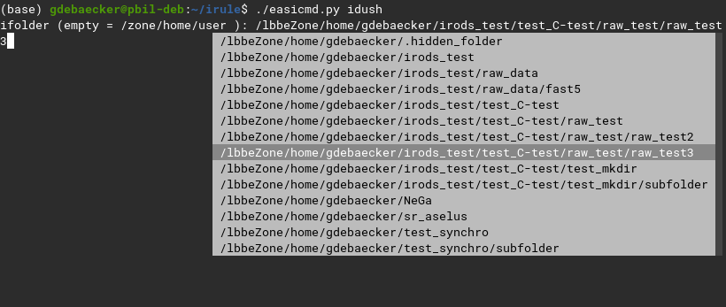

# EASy-Irods-CoMmanDs (easicmd)
## Short description
easicmd is a python script written to facilitate/automate the use of irods for new users and add the autocompletion for some irods commands by using prompt_toolkit module.

## Dependancies
- python 3.6 for the f-string (the script can be rewritten for older version of python by replacing f-string by str.format()) 
- [prompt_toolkit](https://python-prompt-toolkit.readthedocs.io/en/master/) (the script install it the first time you run it if it's not already install)

## Commands
```
Possible COMMANDS :

	add_meta	: add_meta or add_meta [irods path]
		  if you don't give an irods path you'll be asked an option ([f] for file or [C] for a folder) then you will have to chose your object help by autocompletion

	help	: print this help and leave
	idush	: equivalent to du -sh for an irods folder

	imkdir	 : imkdir -p reinforce by autocompletion

	irm	: irm [option]
		 options are [-f] for a file and [-C] for a folder 
		 allow to irm one or multiple (if * used) folder/file in irods. You don't need to know the path in irods as it will be helped by autocompletion

	pull	: pull [option] [local path]
		  irsync/iget folder/file from irods to local with autocompletion
		  For a file add option -f
		  For a folder add option -C
		  path can be full path or '.' for current folder
		  if no path given, a list of all the folder from root will be proposed (can be very long if you have many)

	push	: irsync/iput folder/file (given by a path) from local to irods with auto completion

	rm_meta	: rm_meta or rm_meta [irods path]
		  if you don't give an irods path you'll be ask an option ([f] for file or [C] for a folder) then you will have to chose your object help by autocompletion

	search_by_meta	: search_by_meta [option] or search_by_meta
		 option are [-f] for a file, [-C] for a folder and [-u] for a user

	search_name	: search_name [option]
		 option are [-f] for a file and [-C] for a folder 
		 search for a file or a folder in irods

	show_meta	: show_meta [option] or show_meta
		 option are [-f] for a file and [-C] for a folder
 
	synchro	: synchro [local path to folder] [optional:irods path]
		 synchronise the contain of a local folder with irods [in irods path if given or in /zone/home/user by default] based on the sha256 
		 can be fully automated with the help of when-changed (https://github.com/joh/when-changed) with : when-changed -r -q [folder] -c 'easicmd.py synchro [folder]'
```

## AUTOCOMPLETION
As it is, IRODS doesn't allow the autocompletion by using tab for data on irods (kind of with *i-commands-auto.bash* see in useful_stuff). The python module *prompt_toolkit* allow us to add some kind of autocompletion when it comes to choosing data on irods. 
When you will have to select a data from irods a list where you can navigate by using TAB or direction keys will be displayed on your screen :


## Examples 
**To simplify when we talk about irods file it refer to data_object and irods folder to collection.**
### PUSH : PUT LOCAL DATA ON IRODS
To put a data (file or folder) on irods you just have to give a path to the data. Then you will be asked where in irods you want to put it. 
When you use **push** to upload data the sha256 is calculated and stock in the icat (option -K in iput).
After "pushing" your data on irods you will be asked if you want to add metadata to your new irods object.

```
### PUT THE LOCAL FOLDER "PROJECT_1" IN THE IRODS FOLDER "MY_PROJECT" AND ADD METADATA
$ ./easicmd.py push PROJECT_1
ifolder (empty = /zone/home/user ): /lbbeZone/home/gdebaecker/MY_PROJECT                             
                               /lbbeZone/home/gdebaecker/irods_test                                   
                               /lbbeZone/home/gdebaecker/irods_test/raw_data                          
                               /lbbeZone/home/gdebaecker/irods_test/raw_data/fast5                    
                               /lbbeZone/home/gdebaecker/MY_PROJECT                                                        
                               /lbbeZone/home/gdebaecker/NeGa                                         
                  
Running recursive pre-scan... pre-scan complete... transferring data...
C- /lbbeZone/home/gdebaecker/MY_PROJECT/PROJECT_1:
0/2 -  0.00% of files done   0.000/0.000 MB -  0.00% of file sizes done
Processing file.fastq - 0.000 MB   2021-11-03.17:06:50
   file.fastq                      0.000 MB | 0.047 sec | 0 thr |  0.000 MB/s
1/2 - 50.00% of files done   0.000/0.000 MB -  0.00% of file sizes done
Processing file.fasta - 0.000 MB   2021-11-03.17:06:50
   file.fasta                      0.000 MB | 0.041 sec | 0 thr |  0.000 MB/s

add metadata ?(y/n): y
attribut (empty to stop) : client
value : MISTER_X
unit : Top_Secret
                       
$ ils -r MY_PROJECT
/lbbeZone/home/gdebaecker/MY_PROJECT:
  C- /lbbeZone/home/gdebaecker/MY_PROJECT/PROJECT_1
/lbbeZone/home/gdebaecker/MY_PROJECT/PROJECT_1:
  file.fasta
  file.fastq

```
### PULL : GET BACK DATA FROM IRODS 
To get back data from irods you have to give **a type ( [-f] for a file and [-C] for a folder )** and the **local path** where you want to download the data. 
If you don't give a path, the script will scan all your local data from the root-folder and ask you where you want to put it (it can take some time if you have many folder).
```
### PUT THE IRODS FOLDER "PROJECT_2" IN THE LOCAL FOLDER "MY_LOCAL_PROJECT"
$ ./easicmd.py pull -C MY_LOCAL_PROJECT/
ifolder (empty = /zone/home/user ): /lbbeZone/home/gdebaecker/MY_PROJECT/PROJECT_2                           
                               /lbbeZone/home/gdebaecker/irods_test                                   
                               /lbbeZone/home/gdebaecker/irods_test/raw_data                          
                               /lbbeZone/home/gdebaecker/irods_test/raw_data/fast5                    
                               /lbbeZone/home/gdebaecker/MY_PROJECT                                   
                               /lbbeZone/home/gdebaecker/MY_PROJECT/PROJECT_2                         
                               /lbbeZone/home/gdebaecker/NeGa                                         
                  
0/3 -  0.00% of files done   0.000/0.000 MB -  0.00% of file sizes done
Processing file_bis.r - 0.000 MB   2021-11-03.17:35:48
   file_bis.r                      0.000 MB | 0.036 sec | 0 thr |  0.000 MB/s
1/3 - 33.33% of files done   0.000/0.000 MB -  0.00% of file sizes done
Processing file.fasta - 0.000 MB   2021-11-03.17:35:48
   file.fasta                      0.000 MB | 0.029 sec | 0 thr |  0.000 MB/s
2/3 - 66.67% of files done   0.000/0.000 MB -  0.00% of file sizes done
Processing file.fastq - 0.000 MB   2021-11-03.17:35:48
   file.fastq                      0.000 MB | 0.027 sec | 0 thr |  0.000 MB/s

$ls MY_LOCAL_PROJECT
PROJECT_2/

### PUT THE CONTAIN OF IRODS FOLDER "PROJECT_2" IN THE LOCAL FOLDER "MY_LOCAL_PROJECT"
$ ./easicmd.py pull -C MY_LOCAL_PROJECT/
ifolder (empty = /zone/home/user ): /lbbeZone/home/gdebaecker/MY_PROJECT/PROJECT_2
irods file (tap tab) : %
   file_bis.r                      0.000 MB | 0.037 sec | 0 thr |  0.000 MB/s
   file.fasta                      0.000 MB | 0.030 sec | 0 thr |  0.000 MB/s
   file.fastq                      0.000 MB | 0.035 sec | 0 thr |  0.000 MB/s

$ls MY_LOCAL_PROJECT
file_bis.r  file.fasta  file.fastq

### DOWNLOAD ONE SPECIFIC FAST5 IRODS FILE IN MY CURRENT LOCAL FOLDER
$./easicmd.py pull -f .
ifolder (empty = /zone/home/user ): /lbbeZone/home/gdebaecker/irods_test/raw_data/fast5
irods file (tap tab) :FAL56006_29db37dd_251.fast5
0/1 -  0.00% of files done   0.000/181.788 MB -  0.00% of file sizes done
Processing FAL56006_29db37dd_251.fast5 - 181.788 MB   2021-11-03.17:42:38
From server: NumThreads=46, addr:lbbe-irods-local, port:20099, cookie=549953450
FAL56006_29db37dd_251.fast5 - 169.932/181.788 MB - 93.48% done   2021-11-03.17:42:38
FAL56006_29db37dd_251.fast5 - 181.788/181.788 MB - 100.00% done   2021-11-03.17:42:38
   FAL56006_29db37dd_251.fas     181.788 MB | 1.709 sec | 46 thr | 106.344 MB/s

$ls FAL56006_29db37dd_251.fast5
FAL56006_29db37dd_251.fast5
```
### SYNCHRO : SYNCHRONIZE MODIFIED DATA FROM A LOCAL FOLDER WITH IRODS
This command take as argument the path to a local folder you want to synchronize with irods and optionally a path in irods where you xwant to synchronise the folder. If the folder is not already on irods it will be created at the root (/zone/home/user) by default or where you give the path and synchronize using rsync.
**If you have already put the folder in irods (with push or synchro) you don't need to give an irods path as the script will find it and do the synchronisation .**
This command can be use when you create a new project and you know that it will often be modified. This command calculate the sha256 of the local file and look for their present in the icat, if they're not in the icat (the file doesn't exist yet in irods or had been edited in local) the file is sent to irods

This command has been written to be associated with [when-changed](https://github.com/joh/when-changed) : every time a change is detected in your folder by *when-changed* it runs the command synchro on your folder.

```
### SYNCHRONISE THE LOCAL FOLDER "Nanoplot" in irods folder "PROJECT_ASSELUS/ONT_READS"

$ ils
/lbbeZone/home/gdebaecker:
  C- /lbbeZone/home/gdebaecker/NeGa
  C- /lbbeZone/home/gdebaecker/PROJECT_ASSELUS

$ ls Nanoplot/
full_report.pdf QC_porechop


$ ./easicmd.py synchro /beegfs/home/gdebaecker/irule/Nanoplot /lbbeZone/home/gdebaecker/PROJECT_ASSELUS/ONT_READS/ 

$ ils ./PROJECT_ASSELUS/ONT_READS/Nanoplot/
/lbbeZone/home/gdebaecker/PROJECT_ASSELUS/ONT_READS/Nanoplot:
  full_report.pdf
  C- /lbbeZone/home/gdebaecker/PROJECT_ASSELUS/ONT_READS/Nanoplot/QC


### NOW WE MODIFY OUR LOCAL FOLDER AND WANT TO SYNCHRONISE IT WITH THE ONE IN IRODS
$ cp -r /beegfs/data/gdebaecker/QC* /beegfs/home/gdebaecker/irule/Nanoplot/

$ ls Nanoplot/
full_report.pdf  QC  QC_3kb  QC_porechop

$ ./easicmd.py synchro /beegfs/home/gdebaecker/irule/Nanoplot/

$ ils ./PROJECT_ASSELUS/ONT_READS/Nanoplot/
/lbbeZone/home/gdebaecker/PROJECT_ASSELUS/ONT_READS/Nanoplot:
  full_report.pdf
  C- /lbbeZone/home/gdebaecker/PROJECT_ASSELUS/ONT_READS/Nanoplot/QC
  C- /lbbeZone/home/gdebaecker/PROJECT_ASSELUS/ONT_READS/Nanoplot/QC_3kb
  C- /lbbeZone/home/gdebaecker/PROJECT_ASSELUS/ONT_READS/Nanoplot/QC_porechop


```

### IMKDIR : CREATE AN IRODS WITHOUT KNOWING THE FULL TREE VIEW
When you want to create a new irods folder without knowing the full tree view. It had the "-p" option by default, so you can create parents folder while creating a folder.
```
$ ils -r 

C- /lbbeZone/home/gdebaecker/irods_test
/lbbeZone/home/gdebaecker/irods_test:
  final_summary_FAL56006_29db37dd.txt
  C- /lbbeZone/home/gdebaecker/NeGa
  C- /lbbeZone/home/gdebaecker/sr_aselus

$ ./easicmd.py imkdir
create : /lbbeZone/home/gdebaecker/irods_test/test_C-test/raw_test/raw_test2/new_folder

$ ils /lbbeZone/home/gdebaecker/irods_test/test_C-test/raw_test/raw_test2/
/lbbeZone/home/gdebaecker/irods_test/test_C-test/raw_test/raw_test2:
  C- /lbbeZone/home/gdebaecker/irods_test/test_C-test/raw_test/raw_test2/new_folder

```

### IRM : REMOVE DATA FROM IRODS
When you no longer need a data on irods, or you need to make some place, you can remove them by using *irm*. This command take as argument the type of the irods data you want to remove and then with the autocompletion you can choose which data you want to remove. You can use "*" to remove several irods objects.

```
### REMOVE ALL THE ".r" file from the "MY_project" irods folder
$ ils ./MY_PROJECT/
/lbbeZone/home/gdebaecker/MY_PROJECT:
  file_bis_2.r
  file_bis_3.r
  file_bis_4.r
  file_bis_5.r
  file_bis.r
  file.fasta
  file.fastq
  C- /lbbeZone/home/gdebaecker/MY_PROJECT/PROJECT_2

$ ./easicmd.py irm -f
you can use * as wildcard
ifolder (empty = /zone/home/user ): /lbbeZone/home/gdebaecker/MY_PROJECT
irods file (tap tab) :*.r

$ ils ./MY_PROJECT/
/lbbeZone/home/gdebaecker/MY_PROJECT:
  file.fasta
  file.fastq
  C- /lbbeZone/home/gdebaecker/MY_PROJECT/PROJECT_2

REMOVE THE "MY_PROJECT" irods folder
$ ils
/lbbeZone/home/gdebaecker:
  C- /lbbeZone/home/gdebaecker/irods_test
  C- /lbbeZone/home/gdebaecker/MY_PROJECT
  C- /lbbeZone/home/gdebaecker/NeGa
  C- /lbbeZone/home/gdebaecker/sr_aselus

$ ./easicmd.py irm -C
you can use * as wildcard
ifolder (empty = /zone/home/user ): /lbbeZone/home/gdebaecker/MY_PROJECT

$ ils
/lbbeZone/home/gdebaecker:
  C- /lbbeZone/home/gdebaecker/irods_test
  C- /lbbeZone/home/gdebaecker/NeGa
  C- /lbbeZone/home/gdebaecker/sr_aselus
```

### ADD_META : ADD METADATA ASSOCIATED WITH AN OBJECT ON IRODS
Adding metadata to your irods objects is important and useful as irods is *originally* thought to be metadata based and not base on tree view. This metadata will be then used to search for your data on irods. If you didn't add metadata to your object when you put it in irods you can add then later on with add_meta. This command take as argument an option ([-f]/[-C]). If you don't give one, you will be asked to choose an option that can be **[f]** for an irods file and **[C]** for an irods folder, and then you can select your irods object with the autocompletion. It's a while loop, so you can add all your metadata at once, to stop it just left the *attribute* empty.
You can use autocompletion for this command so if you reuse attribute it's more easy and less error-prone. If you want to gain time and doesn't need the autocompletion you can commant the line about attribute in ADD_META(). 

```
### ADD METADATA TO IRODS FOLDER "sr_aselus"
$ ./easicmd.py add_meta 
add metadata to folder (C) or file (f) : C
ifolder (empty = /zone/home/user ): /lbbeZone/home/gdebaecker/sr_aselus
attribut (empty to stop) : technology
value : illumina
unit : 150pb
imeta add -C /lbbeZone/home/gdebaecker/sr_aselus technology illumina 150pb
attribut (empty to stop) : Species
value : Proasellus_coiffaiti            
unit : 
imeta add -C /lbbeZone/home/gdebaecker/sr_aselus Species Proasellus_coiffaiti 
attribut (empty to stop) : Coverage
value : 200X
unit : 
imeta add -C /lbbeZone/home/gdebaecker/sr_aselus Coverage 200X 
attribut (empty to stop) : 

$ imeta ls -C sr_aselus/
AVUs defined for collection /lbbeZone/home/gdebaecker/sr_aselus:
attribute: Species
value: Proasellus_coiffaiti
units: 
----
attribute: technology
value: illumina
units: 150pb
----
attribute: Coverage
value: 200X
units: 
```

### RM_META : REMOVING METADATA ASSOCIATED WITH AN OBJECT ON IRODS
If you made a mistake while adding metadata, you can remove them with the command rm_meta. This command take as argument an option ([-f] or [-C]). If you did not give one, you will be asked to choose an option that can be **[f]** for an irods file and **[C]** for an irods folder, and then you can select your irods object with the autocompletion.

```
### REMOVE METADATA FROM IRODS FOLDER "sr_aselus"
## REMOVE THE "species" METADATA
$ imeta ls -C sr_aselus/
AVUs defined for collection /lbbeZone/home/gdebaecker/sr_aselus:
attribute: Species
value: Proasellus_coiffaiti
units: 
----
attribute: technology
value: illumina
units: 150pb
----
attribute: Coverage
value: 200X
units:

$./easicmd.py rm_meta
remove metadata from folder (C) or file (f) : C
ifolder (empty = /zone/home/user ): /lbbeZone/home/gdebaecker/sr_aselus
attribut (empty for all): Species

$ imeta ls -C sr_aselus/
AVUs defined for collection /lbbeZone/home/gdebaecker/sr_aselus:
attribute: technology
value: illumina
units: 150pb
----
attribute: Coverage
value: 200X
units: 

$./easicmd.py rm_meta
remove metadata from folder (C) or file (f) : C
ifolder (empty = /zone/home/user ): /lbbeZone/home/gdebaecker/sr_aselus
attribut (empty for all):

$ imeta ls -C sr_aselus/
AVUs defined for collection /lbbeZone/home/gdebaecker/sr_aselus:
None

```

### SHOW_META : SHOW ALL THE METADATA ASSOCIATED WITH AN OBJECT ON IRODS
If you want to know the metadata associated with an irods object, you can use the command show_meta. This command takes as argument an option that can be **[f]** for an irods file and **[C]** for an irods folder, and then you can select your irods object with the autocompletion.
```
$ ./easicmd.py show_meta -C
ifolder (empty = /zone/home/user ): /lbbeZone/home/gdebaecker/sr_aselus
AVUs defined for collection /lbbeZone/home/gdebaecker/sr_aselus:
attribute: technology
value: illumina
units: 150pb
----
attribute: Species
value: Proassellus_coifaiti
units: 

```

### SEARCH_BY_META : SEARCH FOR IRODS OBJECTS (FOLDER/FILE) BASED ON THE METADATA
If you have associated metadata to your object, you can find them later by making query based on this metadata. The command *search_by_meta* take as argument an option that can be **[f]** for an irods file and **[C]** for an irods folder, and then ask you which attributes/values you want to query helped with the autocompletion. 
The script create a dictionary where the key are the attributes and the values are the values(metadata) associates with this attribute, so you can't ask for attributes that do not exist or values not associates with an attribute.

```
###SEARCH ALL THE IRODS FOLDER THAT HAVE THE ATTRIBUTE "technology"
./easicmd.py search_by_meta -C
attribute:  technology
              auteur         
              technology   
              Species      
value (% as *): %
                   illumina  
                   Nanopore  

collection: /lbbeZone/home/gdebaecker/irods_test/raw_data/fast5
----
collection: /lbbeZone/home/gdebaecker/sr_aselus

```

### SEARCH_NAME : SEARCH FOR IRODS OBJECT BASED ON (PARTS) OF THE OBJECT NAME
If you forget to associated metadata to your object, you can find them later by making query based on their name or a part of it. The command *search_name* take as argument an option that can be **[f]** for an irods file and **[C]** for an irods folder, and then you will be asked to give your query where **%** can be use as a wildcard.

```
### FIND ALL THE ".fast5" FILES ON IRODS
$ ./easicmd.py search_name -f
your query(% as *) : %.fast5
/lbbeZone/home/gdebaecker/irods_test/raw_data/FAL56006_29db37dd_253.fast5
/lbbeZone/home/gdebaecker/irods_test/raw_data/fast5/FAL56006_29db37dd_250.fast5
/lbbeZone/home/gdebaecker/irods_test/raw_data/fast5/FAL56006_29db37dd_251.fast5
/lbbeZone/home/gdebaecker/irods_test/raw_data/fast5/FAL56006_29db37dd_252.fast5
/lbbeZone/home/gdebaecker/irods_test/raw_data/fast5/FAL56006_29db37dd_253.fast5
/lbbeZone/home/gdebaecker/irods_test/raw_data/fast5/FAL56006_29db37dd_25.fast5
/lbbeZone/home/gdebaecker/irods_test/test_C-test/raw_test/raw_test3/FAL56006_29db37dd_253.fast5

###FIND ALL THE "fastQ" FOLDER IN IRODS
$ ./easicmd.py search_name -C
your query (you can use *): *fastQ
/lbbeZone/home/gdebaecker/irods_test/raw_data/UNICORN_AND_DRAGON/fastQ
/lbbeZone/home/gdebaecker/NeGa/MY_2nd_PORJECT/TIGER/fastQ
/lbbeZone/home/gdebaecker/NeGa/MY_PROJECT/Proasellus/fastQ

```

### IDUSH : AN IRODS EQUIVALENT TO du -sh  
If you want to know the size of a folder on irods you can use idush. It makes the sum of the size of all the irods files inside an irods folder and print it. If you don't know if you will have enough place on your disk before the download, you can verify it with idush.

```
$ ./easicmd.py idush
ifolder (empty = /zone/home/user ): /lbbeZone/home/gdebaecker/irods_test/raw_data/fast5                               
                               /lbbeZone/home/gdebaecker/irods_test                                   
                               /lbbeZone/home/gdebaecker/irods_test/raw_data                          
                               /lbbeZone/home/gdebaecker/irods_test/raw_data/fast5                    

913.7MiB

```


## To-Do List
- [X] ~~Update synchro function, so it can synchronize irods folder already present in irods and not only in the root (/zone/home/user) + verify that the file is not only in the synchronized target and not in all irods (for example now if you want to synchronize a new folder containing example.txt but that identical example.txt already exist somewhere in irods this file will not be synchronized. Initially it was thinks for avoiding duplication of data, but it can be upgrade).~~
- [ ] Auto-parsing function to add automatically metadata to object like date/format/author/etc
- [ ] Replace auto-completion with something closer to unix autocompletion (e.g : https://typer.tiangolo.com/typer-cli/)