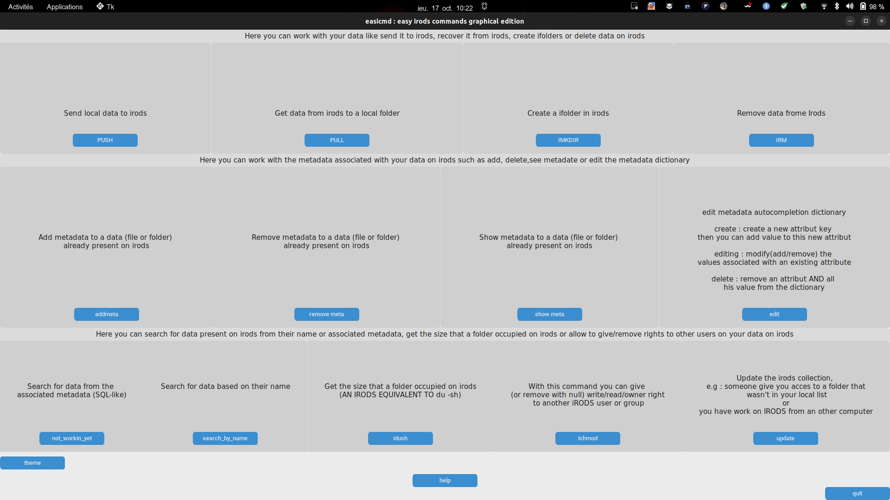
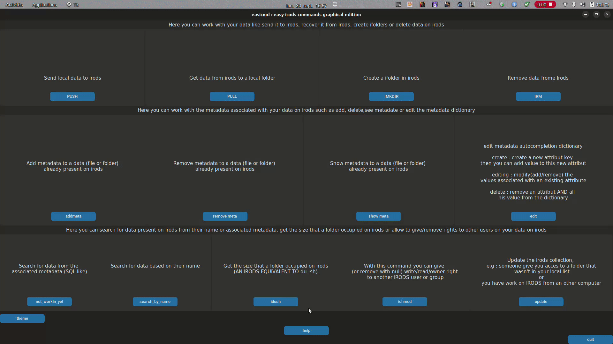
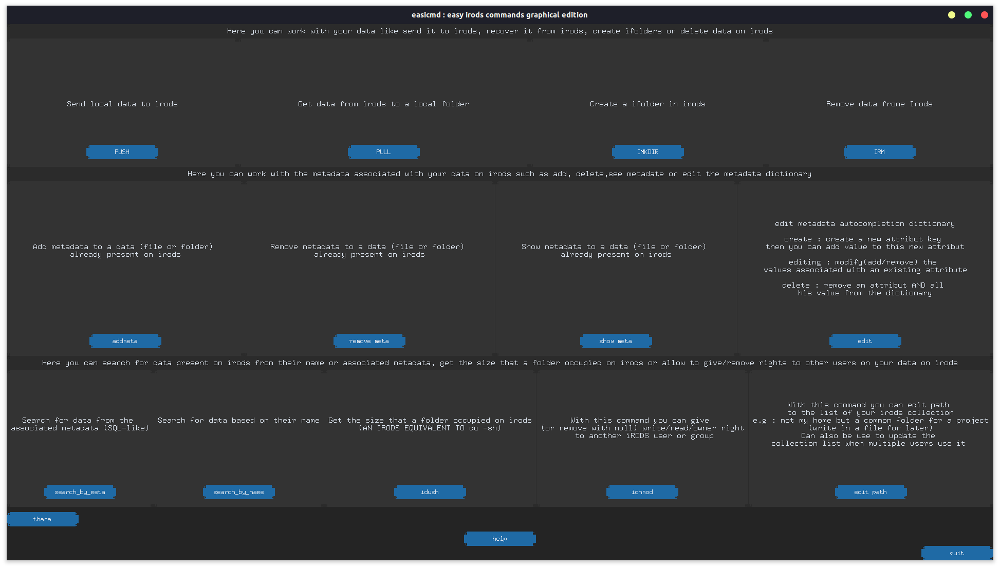

# EASy-Irods-CoMmanDs (easicmd)

## The script easicmd.py and gui_easicmd.py need the icommand to be in your path. Can run on linux and mac (as long as the icommand are in the path). 
## The api_easicmd.py and api_gui_easicmd.py scripts are the new versions which no longer depend on icommands but are based on the irods python api (no need to change icommand clients when the server changes version of irods). Can run on linux, mac AND windows.

## Short description
Easicmd is a user-friendly Python script that provides a graphical interface for interacting with irods. It simplifies the usage of icommands by generating intuitive commands, making it ideal for new users or individuals who prefer a graphical interface over the command line. With Easicmd, you can effortlessly perform common tasks such as uploading and downloading data from irods, creating directories, managing metadata, searching for data by name or metadata, and retrieving essential information like directory size. Additionally, it streamlines the process of sharing data access with other users or groups. Enjoy a hassle-free irods experience with Easicmd!

**For Windows users** : You can double click on **gui_easicmd_windows_launcher.bat** it will create the virtual environement and run the graphical version of easicmd using the api. You now have a clikable launcher for the graphical version of easicmd.(it's possible that when you double click on the bat it open notepad, you need to associate the opening of a .ps1 file with powershell or just close the notepad, which will trigger execution of the script ). [Before running the script](#before-running-api_easicmdpy-or-api_gui_easicmdpy)

We're aware of a screen scaling issue on Windows systems that may cause script windows to exceed the screen size due to scaling set above 100%. While we're actively working on a fix, a temporary solution is available:
1. Go to "Settings" > "System" > "Display."
2. Under "Scale and layout," set "Size of text, apps, and other items" to a maximum of 100%.
This adjustment should prevent windows from extending beyond the screen until a permanent resolution is implemented.

## Dependancies

- ~~Irods icommands (in your path + iinit already done at least once)~~ no longer necessary if you use the api version (neoeasicmd.py and neo_gui_easicmd.py)
- **python 3.7** or more for the f-string (the script can be rewritten for older version of python by replacing f-string by str.format()) and subprocess (capture_output)
- [prompt_toolkit](https://python-prompt-toolkit.readthedocs.io/en/master/) (the script install it the first time you run it if it's not already install)

For graphical user interface
- **tkinter** (Linux : sudo apt-get install python3-tk | windows : during the installation process of Python ensure that you select the option to install Tcl/Tk and Tkinter  )
- [ttkwidgets](https://ttkwidgets.readthedocs.io/en/latest/installation.html) (for the autocompletion in the GUI, the script install it the first time you run it if it's not already install)
- [CustomTkinter](https://customtkinter.tomschimansky.com/) (the script install it the first time you run it if it's not already install)

You can also create a python virtualenv with the following command line (on windows it will be create when using the .bat):
```
python -m venv env_easicmd
source env_easicmd/bin/activate
pip install -r requirements.txt
```
This will create a virtualenv with all the dependencies installed and not interact with your main environement/installation

## COMMAND LINE OR GRAPHICAL USER INTERFACE (GUI)
- ./easicmd.py --> run the command line version
- ./gui_easicmd.py --> launch the GUI version

~~**In any case activate irods before running the script --> iinit**~~ no longer necessary if you use the api version (neoeasicmd.py and neo_gui_easicmd.py)

## Before running api_easicmd.py or api_gui_easicmd.py
**Fill in the irods_info file with the following information** :
```
{
    "host": "hostname", ## e.g : ccirods.in2p3.fr
    "port": 5588,  ## adapt to yur server
    "user": "username", ## your username
    "password": "supersecuredpassword", ## your password
    "zone": "irodsZone" ## e.g : rhone-alpes
}
```

## NEW interface with CustumTkinter
**Light theme**
 
**Dark Theme**
 

## Commands
```
Possible COMMANDS :

	add_meta	: add_meta or add_meta [irods path]
		  if you don't give an irods path you'll be asked an option ([f] for file or [C] for a folder) then you will have to chose your object help by autocompletion

  add_path  : add additional path to your irods path autocompletion (e.g : not my home but a common folder for a project)(stock in a file [~/.irods_additional_path_save.pkl] for later)

	build_dico_meta : create a file in your home directory containing the dictionary with your metadata attribute and value.
                    As it's in local you just to have to run this the first time and when you add metadata it will be update.
                    This is usefull because when you have many file in your irods vault it take a very long time to get this dictionary if you have to do it every time you need the autocompletion for metadata 

	help	: print this help and leave
  
	ichmod	: give right to other user/group over some of your data (e.g give read right over one iCollection)

	idush	: equivalent to du -sh for an irods folder

	imkdir	 : imkdir -p reinforce by autocompletion

	irm	: irm [option]
		 options are [-f] for a file and [-C] for a folder 
		 allow to irm one or multiple (if * used) folder/file in irods. You don't need to know the path in irods as it will be helped by autocompletion

	pull	: pull [option] [local path]
		  irsync/iget folder/file from irods to local with autocompletion
		  For a file add option -f
		  For a folder add option -C
		  path can be full path or '.' for current folder
		  if no path given, a list of all the folder from root will be proposed (can be very long if you have many)

	push	: irsync/iput folder/file (given by a path) from local to irods with auto completion

	rm_meta	: rm_meta or rm_meta [irods path]
		  if you don't give an irods path you'll be ask an option ([f] for file or [C] for a folder) then you will have to chose your object help by autocompletion
  
  rm_path: remove additional path you already add but don't need anymore

	search_by_meta	: search_by_meta [option] or search_by_meta
		 option are [-f] for a file, [-C] for a folder and [-u] for a user

	search_name	: search_name [option]
		 option are [-f] for a file and [-C] for a folder 
		 search for a file or a folder in irods

	show_meta	: show_meta [option] or show_meta
		 option are [-f] for a file and [-C] for a folder
 
	synchro	: synchro [local path to folder] [optional:irods path]
		 synchronise the contain of a local folder with irods [in irods path if given or in /zone/home/user by default] based on the sha256 
		 can be fully automated with the help of when-changed (https://github.com/joh/when-changed) with : when-changed -r -q [folder] -c 'easicmd.py synchro [folder]'
```

## AUTOCOMPLETION
**FOR BASH ARGUMENT AUTOCOMPLETION**

You can use **TAB** when using easicmd.py to call the possible argument/command for that you have to "*source useful_stuff/easicmd-completion.bash*" or add "*source path/to/useful_stuff/easicmd-completion.bash*" to your .bashrc.

```
$ source useful_stuff/easicmd-completion.bash 

$ ./easicmd.py 
add_meta         build_dico_meta  ichmod           imkdir           pull             rm_meta          search_name      synchro          
add_path         help             idush            irm              push             search_by_meta   show_meta        

$ ./easicmd.py s
search_by_meta  search_name     show_meta       synchro         

$ ./easicmd.py search_
search_by_meta  search_name     

$ ./easicmd.py search_by_meta 
```
**FOR IRODS AUTOCOMPLETION**

As it is, IRODS doesn't allow the autocompletion by using tab for data on irods (kind of with *i-commands-auto.bash* see in useful_stuff). The python module *prompt_toolkit* allow us to add some kind of autocompletion when it comes to choosing data on irods. 
When you will have to select a data from irods a list where you can navigate by using TAB or direction keys will be displayed on your screen :


## FILES CREATED BY THE SCRIPT
The script will create the first time you use it three different files in your home folder:
- ~/.irods_additional_path_save.pkl : That contain all the additional path allowing you to use the autocompletion on irods folder not in your /zone/home/user (it will be updated automatically after every operation on additional path)
- ~/.irods_collection_save.pkl : A list of all your collection (equivalent to "ils -r") can take a little bit of time the first time, but it will save you time later (it will be updated automatically after every operation)
- ~/.irods_metadata_local_save.pkl : A dictionary of all the metadata you already used, that will be used for the autocompletion when you add metadata (it will be updated automatically after every operation)
## Examples 
**To simplify when we talk about irods file it refer to data_object and irods folder to collection.**

### BUILD_DICO_META : CREATE A DICTIONARY OF METADATA IN YOUR LOCAL HOME
This command create a file (*.irods_metadata_local_save.pkl*) in your local home folder. This usefull because to have the autocompletion when working on metadata you have to loop on all your file that can be very timeconsumming when you have many or have to do it many time. This dictionary will be update when you add new metadata. 
The good pratice would be to create this dictionnary before puting any data on irods or if you already have data on irods with metadata associated you can run this command and wait that the dictionary is built.

```
### BUILD THE DICTIONARY IN LOCAL TO ACCES AUTOCOMPLETION ON METADATA
$ ./easicmd.py build_dico_meta
Dictionary have been save in /beegfs/home/gdebaecker/.irods_metadata_local_save.pkl
```
### PUSH : PUT LOCAL DATA ON IRODS
To put a data (file or folder) on irods you just have to give a path to the data. Then you will be asked where in irods you want to put it. 
When you use **push** to upload data the sha256 is calculated and stock in the icat (option -K in iput).
After "pushing" your data on irods you will be asked if you want to add metadata to your new irods object.

```
### PUT THE LOCAL FOLDER "PROJECT_1" IN THE IRODS FOLDER "MY_PROJECT" AND ADD METADATA
$ ./easicmd.py push PROJECT_1
ifolder (empty = /zone/home/user ): /lbbeZone/home/gdebaecker/MY_PROJECT                             
                               /lbbeZone/home/gdebaecker/irods_test                                   
                               /lbbeZone/home/gdebaecker/irods_test/raw_data                          
                               /lbbeZone/home/gdebaecker/irods_test/raw_data/fast5                    
                               /lbbeZone/home/gdebaecker/MY_PROJECT                                                        
                               /lbbeZone/home/gdebaecker/NeGa                                         
                  
Running recursive pre-scan... pre-scan complete... transferring data...
C- /lbbeZone/home/gdebaecker/MY_PROJECT/PROJECT_1:
0/2 -  0.00% of files done   0.000/0.000 MB -  0.00% of file sizes done
Processing file.fastq - 0.000 MB   2021-11-03.17:06:50
   file.fastq                      0.000 MB | 0.047 sec | 0 thr |  0.000 MB/s
1/2 - 50.00% of files done   0.000/0.000 MB -  0.00% of file sizes done
Processing file.fasta - 0.000 MB   2021-11-03.17:06:50
   file.fasta                      0.000 MB | 0.041 sec | 0 thr |  0.000 MB/s

add metadata ?(y/n): y
attribut (empty to stop) : client
value : MISTER_X
unit : Top_Secret
                       
$ ils -r MY_PROJECT
/lbbeZone/home/gdebaecker/MY_PROJECT:
  C- /lbbeZone/home/gdebaecker/MY_PROJECT/PROJECT_1
/lbbeZone/home/gdebaecker/MY_PROJECT/PROJECT_1:
  file.fasta
  file.fastq

```
**With the GUI**:


### PULL : GET BACK DATA FROM IRODS 
To get back data from irods you have to give **a type ( [-f] for a file and [-C] for a folder )** and the **local path** where you want to download the data. 
If you don't give a path, the script will scan all your local data from the root-folder and ask you where you want to put it (it can take some time if you have many folder).
```
### PUT THE IRODS FOLDER "PROJECT_2" IN THE LOCAL FOLDER "MY_LOCAL_PROJECT"
$ ./easicmd.py pull -C MY_LOCAL_PROJECT/
ifolder (empty = /zone/home/user ): /lbbeZone/home/gdebaecker/MY_PROJECT/PROJECT_2                           
                               /lbbeZone/home/gdebaecker/irods_test                                   
                               /lbbeZone/home/gdebaecker/irods_test/raw_data                          
                               /lbbeZone/home/gdebaecker/irods_test/raw_data/fast5                    
                               /lbbeZone/home/gdebaecker/MY_PROJECT                                   
                               /lbbeZone/home/gdebaecker/MY_PROJECT/PROJECT_2                         
                               /lbbeZone/home/gdebaecker/NeGa                                         
                  
0/3 -  0.00% of files done   0.000/0.000 MB -  0.00% of file sizes done
Processing file_bis.r - 0.000 MB   2021-11-03.17:35:48
   file_bis.r                      0.000 MB | 0.036 sec | 0 thr |  0.000 MB/s
1/3 - 33.33% of files done   0.000/0.000 MB -  0.00% of file sizes done
Processing file.fasta - 0.000 MB   2021-11-03.17:35:48
   file.fasta                      0.000 MB | 0.029 sec | 0 thr |  0.000 MB/s
2/3 - 66.67% of files done   0.000/0.000 MB -  0.00% of file sizes done
Processing file.fastq - 0.000 MB   2021-11-03.17:35:48
   file.fastq                      0.000 MB | 0.027 sec | 0 thr |  0.000 MB/s

$ls MY_LOCAL_PROJECT
PROJECT_2/

### PUT THE CONTAIN OF IRODS FOLDER "PROJECT_2" IN THE LOCAL FOLDER "MY_LOCAL_PROJECT"
$ ./easicmd.py pull -C MY_LOCAL_PROJECT/
ifolder (empty = /zone/home/user ): /lbbeZone/home/gdebaecker/MY_PROJECT/PROJECT_2
irods file (tap tab) : %
   file_bis.r                      0.000 MB | 0.037 sec | 0 thr |  0.000 MB/s
   file.fasta                      0.000 MB | 0.030 sec | 0 thr |  0.000 MB/s
   file.fastq                      0.000 MB | 0.035 sec | 0 thr |  0.000 MB/s

$ls MY_LOCAL_PROJECT
file_bis.r  file.fasta  file.fastq

### DOWNLOAD ONE SPECIFIC FAST5 IRODS FILE IN MY CURRENT LOCAL FOLDER
$./easicmd.py pull -f .
ifolder (empty = /zone/home/user ): /lbbeZone/home/gdebaecker/irods_test/raw_data/fast5
irods file (tap tab) :FAL56006_29db37dd_251.fast5
0/1 -  0.00% of files done   0.000/181.788 MB -  0.00% of file sizes done
Processing FAL56006_29db37dd_251.fast5 - 181.788 MB   2021-11-03.17:42:38
From server: NumThreads=46, addr:lbbe-irods-local, port:20099, cookie=549953450
FAL56006_29db37dd_251.fast5 - 169.932/181.788 MB - 93.48% done   2021-11-03.17:42:38
FAL56006_29db37dd_251.fast5 - 181.788/181.788 MB - 100.00% done   2021-11-03.17:42:38
   FAL56006_29db37dd_251.fas     181.788 MB | 1.709 sec | 46 thr | 106.344 MB/s

$ls FAL56006_29db37dd_251.fast5
FAL56006_29db37dd_251.fast5
```
**With the GUI**:


### SYNCHRO : SYNCHRONIZE MODIFIED DATA FROM A LOCAL FOLDER WITH IRODS
This command take as argument the path to a local folder you want to synchronize with irods and optionally a path in irods where you xwant to synchronise the folder. If the folder is not already on irods it will be created at the root (/zone/home/user) by default or where you give the path and synchronize using rsync.
**If you have already put the folder in irods (with push or synchro) you don't need to give an irods path as the script will find it and do the synchronisation .**
This command can be use when you create a new project and you know that it will often be modified. This command calculate the sha256 of the local file and look for their present in the icat, if they're not in the icat (the file doesn't exist yet in irods or had been edited in local) the file is sent to irods

This command has been written to be associated with [when-changed](https://github.com/joh/when-changed) : every time a change is detected in your folder by *when-changed* it runs the command synchro on your folder.

```
### SYNCHRONISE THE LOCAL FOLDER "Nanoplot" in irods folder "PROJECT_ASSELUS/ONT_READS"

$ ils
/lbbeZone/home/gdebaecker:
  C- /lbbeZone/home/gdebaecker/NeGa
  C- /lbbeZone/home/gdebaecker/PROJECT_ASSELUS

$ ls Nanoplot/
full_report.pdf QC_porechop


$ ./easicmd.py synchro /beegfs/home/gdebaecker/irule/Nanoplot /lbbeZone/home/gdebaecker/PROJECT_ASSELUS/ONT_READS/ 

$ ils ./PROJECT_ASSELUS/ONT_READS/Nanoplot/
/lbbeZone/home/gdebaecker/PROJECT_ASSELUS/ONT_READS/Nanoplot:
  full_report.pdf
  C- /lbbeZone/home/gdebaecker/PROJECT_ASSELUS/ONT_READS/Nanoplot/QC


### NOW WE MODIFY OUR LOCAL FOLDER AND WANT TO SYNCHRONISE IT WITH THE ONE IN IRODS
$ cp -r /beegfs/data/gdebaecker/QC* /beegfs/home/gdebaecker/irule/Nanoplot/

$ ls Nanoplot/
full_report.pdf  QC  QC_3kb  QC_porechop

$ ./easicmd.py synchro /beegfs/home/gdebaecker/irule/Nanoplot/

$ ils ./PROJECT_ASSELUS/ONT_READS/Nanoplot/
/lbbeZone/home/gdebaecker/PROJECT_ASSELUS/ONT_READS/Nanoplot:
  full_report.pdf
  C- /lbbeZone/home/gdebaecker/PROJECT_ASSELUS/ONT_READS/Nanoplot/QC
  C- /lbbeZone/home/gdebaecker/PROJECT_ASSELUS/ONT_READS/Nanoplot/QC_3kb
  C- /lbbeZone/home/gdebaecker/PROJECT_ASSELUS/ONT_READS/Nanoplot/QC_porechop


```

### IMKDIR : CREATE AN IRODS WITHOUT KNOWING THE FULL TREE VIEW
When you want to create a new irods folder without knowing the full tree view. It had the "-p" option by default, so you can create parents folder while creating a folder.
```
$ ils -r 

C- /lbbeZone/home/gdebaecker/irods_test
/lbbeZone/home/gdebaecker/irods_test:
  final_summary_FAL56006_29db37dd.txt
  C- /lbbeZone/home/gdebaecker/NeGa
  C- /lbbeZone/home/gdebaecker/sr_aselus

$ ./easicmd.py imkdir
create : /lbbeZone/home/gdebaecker/irods_test/test_C-test/raw_test/raw_test2/new_folder

$ ils /lbbeZone/home/gdebaecker/irods_test/test_C-test/raw_test/raw_test2/
/lbbeZone/home/gdebaecker/irods_test/test_C-test/raw_test/raw_test2:
  C- /lbbeZone/home/gdebaecker/irods_test/test_C-test/raw_test/raw_test2/new_folder

```
**With the GUI**:


### IRM : REMOVE DATA FROM IRODS
When you no longer need a data on irods, or you need to make some place, you can remove them by using *irm*. This command take as argument the type of the irods data you want to remove and then with the autocompletion you can choose which data you want to remove. You can use "*" to remove several irods objects.

```
### REMOVE ALL THE ".r" file from the "MY_project" irods folder
$ ils ./MY_PROJECT/
/lbbeZone/home/gdebaecker/MY_PROJECT:
  file_bis_2.r
  file_bis_3.r
  file_bis_4.r
  file_bis_5.r
  file_bis.r
  file.fasta
  file.fastq
  C- /lbbeZone/home/gdebaecker/MY_PROJECT/PROJECT_2

$ ./easicmd.py irm -f
you can use * as wildcard
ifolder (empty = /zone/home/user ): /lbbeZone/home/gdebaecker/MY_PROJECT
irods file (tap tab) :*.r

$ ils ./MY_PROJECT/
/lbbeZone/home/gdebaecker/MY_PROJECT:
  file.fasta
  file.fastq
  C- /lbbeZone/home/gdebaecker/MY_PROJECT/PROJECT_2

REMOVE THE "MY_PROJECT" irods folder
$ ils
/lbbeZone/home/gdebaecker:
  C- /lbbeZone/home/gdebaecker/irods_test
  C- /lbbeZone/home/gdebaecker/MY_PROJECT
  C- /lbbeZone/home/gdebaecker/NeGa
  C- /lbbeZone/home/gdebaecker/sr_aselus

$ ./easicmd.py irm -C
you can use * as wildcard
ifolder (empty = /zone/home/user ): /lbbeZone/home/gdebaecker/MY_PROJECT

$ ils
/lbbeZone/home/gdebaecker:
  C- /lbbeZone/home/gdebaecker/irods_test
  C- /lbbeZone/home/gdebaecker/NeGa
  C- /lbbeZone/home/gdebaecker/sr_aselus
```
**With the GUI**:


### ADD_META : ADD METADATA ASSOCIATED WITH AN OBJECT ON IRODS
Adding metadata to your irods objects is important and useful as irods is *originally* thought to be metadata based and not base on tree view. This metadata will be then used to search for your data on irods. If you didn't add metadata to your object when you put it in irods you can add then later on with add_meta. This command take as argument an option ([-f]/[-C]). If you don't give one, you will be asked to choose an option that can be **[f]** for an irods file and **[C]** for an irods folder, and then you can select your irods object with the autocompletion. It's a while loop, so you can add all your metadata at once, to stop it just left the *attribute* empty.
You can use autocompletion for this command so if you reuse attribute it's more easy and less error-prone. If you want to gain time and doesn't need the autocompletion you can commant the line about attribute in ADD_META(). 

```
### ADD METADATA TO IRODS FOLDER "sr_aselus"
$ ./easicmd.py add_meta 
add metadata to folder (C) or file (f) : C
ifolder (empty = /zone/home/user ): /lbbeZone/home/gdebaecker/sr_aselus
attribut (empty to stop) : technology
value : illumina
unit : 150pb
imeta add -C /lbbeZone/home/gdebaecker/sr_aselus technology illumina 150pb
attribut (empty to stop) : Species
value : Proasellus_coiffaiti            
unit : 
imeta add -C /lbbeZone/home/gdebaecker/sr_aselus Species Proasellus_coiffaiti 
attribut (empty to stop) : Coverage
value : 200X
unit : 
imeta add -C /lbbeZone/home/gdebaecker/sr_aselus Coverage 200X 
attribut (empty to stop) : 

$ imeta ls -C sr_aselus/
AVUs defined for collection /lbbeZone/home/gdebaecker/sr_aselus:
attribute: Species
value: Proasellus_coiffaiti
units: 
----
attribute: technology
value: illumina
units: 150pb
----
attribute: Coverage
value: 200X
units: 
```
**With the GUI**:


### RM_META : REMOVING METADATA ASSOCIATED WITH AN OBJECT ON IRODS
If you made a mistake while adding metadata, you can remove them with the command rm_meta. This command take as argument an option ([-f] or [-C]). If you did not give one, you will be asked to choose an option that can be **[f]** for an irods file and **[C]** for an irods folder, and then you can select your irods object with the autocompletion.

```
### REMOVE METADATA FROM IRODS FOLDER "sr_aselus"
## REMOVE THE "species" METADATA
$ imeta ls -C sr_aselus/
AVUs defined for collection /lbbeZone/home/gdebaecker/sr_aselus:
attribute: Species
value: Proasellus_coiffaiti
units: 
----
attribute: technology
value: illumina
units: 150pb
----
attribute: Coverage
value: 200X
units:

$./easicmd.py rm_meta
remove metadata from folder (C) or file (f) : C
ifolder (empty = /zone/home/user ): /lbbeZone/home/gdebaecker/sr_aselus
attribut (empty for all): Species

$ imeta ls -C sr_aselus/
AVUs defined for collection /lbbeZone/home/gdebaecker/sr_aselus:
attribute: technology
value: illumina
units: 150pb
----
attribute: Coverage
value: 200X
units: 

$./easicmd.py rm_meta
remove metadata from folder (C) or file (f) : C
ifolder (empty = /zone/home/user ): /lbbeZone/home/gdebaecker/sr_aselus
attribut (empty for all):

$ imeta ls -C sr_aselus/
AVUs defined for collection /lbbeZone/home/gdebaecker/sr_aselus:
None

```
**With the GUI**:


### SHOW_META : SHOW ALL THE METADATA ASSOCIATED WITH AN OBJECT ON IRODS
If you want to know the metadata associated with an irods object, you can use the command show_meta. This command takes as argument an option that can be **[f]** for an irods file and **[C]** for an irods folder, and then you can select your irods object with the autocompletion.
```
$ ./easicmd.py show_meta -C
ifolder (empty = /zone/home/user ): /lbbeZone/home/gdebaecker/sr_aselus
AVUs defined for collection /lbbeZone/home/gdebaecker/sr_aselus:
attribute: technology
value: illumina
units: 150pb
----
attribute: Species
value: Proassellus_coifaiti
units: 

```
**With the GUI**:



### SEARCH_BY_META : SEARCH FOR IRODS OBJECTS (FOLDER/FILE) BASED ON THE METADATA
If you have associated metadata to your object, you can find them later by making query based on this metadata. The command *search_by_meta* take as argument an option that can be **[f]** for an irods file and **[C]** for an irods folder, and then ask you which attributes/values you want to query helped with the autocompletion. 
The script create a dictionary where the key are the attributes and the values are the values(metadata) associates with this attribute, so you can't ask for attributes that do not exist or values not associates with an attribute.

```
###SEARCH ALL THE IRODS FOLDER THAT HAVE THE ATTRIBUTE "technology" CREATED BEFORE  2020
./easicmd.py search_by_meta -C
attribute:  technology
              auteur         
              technology   
              Species      
value (% as *): %
                   illumina  
                   Nanopore  
operation (like if your value contain % as a *): like 
liaison (empty to stop): and
attribute: year
value (% as *): 2020
operation (like if your value contain % as a *): '<'
liaison (empty to stop):

collection: /lbbeZone/home/gdebaecker/irods_test/raw_data/fast5
----
collection: /lbbeZone/home/gdebaecker/sr_aselus

```
**With the GUI**:


### SEARCH_NAME : SEARCH FOR IRODS OBJECT BASED ON (PARTS) OF THE OBJECT NAME
If you forget to associated metadata to your object, you can find them later by making query based on their name or a part of it. The command *search_name* take as argument an option that can be **[f]** for an irods file and **[C]** for an irods folder, and then you will be asked to give your query where **%** can be use as a wildcard.

```
### FIND ALL THE ".fast5" FILES ON IRODS
$ ./easicmd.py search_name -f
your query(% as *) : %.fast5
/lbbeZone/home/gdebaecker/irods_test/raw_data/FAL56006_29db37dd_253.fast5
/lbbeZone/home/gdebaecker/irods_test/raw_data/fast5/FAL56006_29db37dd_250.fast5
/lbbeZone/home/gdebaecker/irods_test/raw_data/fast5/FAL56006_29db37dd_251.fast5
/lbbeZone/home/gdebaecker/irods_test/raw_data/fast5/FAL56006_29db37dd_252.fast5
/lbbeZone/home/gdebaecker/irods_test/raw_data/fast5/FAL56006_29db37dd_253.fast5
/lbbeZone/home/gdebaecker/irods_test/raw_data/fast5/FAL56006_29db37dd_25.fast5
/lbbeZone/home/gdebaecker/irods_test/test_C-test/raw_test/raw_test3/FAL56006_29db37dd_253.fast5

###FIND ALL THE "fastQ" FOLDER IN IRODS
$ ./easicmd.py search_name -C
your query (you can use *): *fastQ
/lbbeZone/home/gdebaecker/irods_test/raw_data/UNICORN_AND_DRAGON/fastQ
/lbbeZone/home/gdebaecker/NeGa/MY_2nd_PORJECT/TIGER/fastQ
/lbbeZone/home/gdebaecker/NeGa/MY_PROJECT/Proasellus/fastQ

```
**With the GUI**:


### IDUSH : AN IRODS EQUIVALENT TO du -sh  
If you want to know the size of a folder on irods you can use idush. It makes the sum of the size of all the irods files inside an irods folder and print it. If you don't know if you will have enough place on your disk before the download, you can verify it with idush.

```
$ ./easicmd.py idush
ifolder (empty = /zone/home/user ): /lbbeZone/home/gdebaecker/irods_test/raw_data/fast5                               
                               /lbbeZone/home/gdebaecker/irods_test                                   
                               /lbbeZone/home/gdebaecker/irods_test/raw_data                          
                               /lbbeZone/home/gdebaecker/irods_test/raw_data/fast5                    

913.7MiB

```

**With the GUI**:


### ICHMOD : SHARE YOUR DATA DIRECTLY IN IRODS
With this command you can give (or remove with *null*) write/read/owner right to another iRODS user or group. You will be ask if you want to give the acces from a collection or a file and have to choose it. Then if you want to give acces to a user or a group and choose it with the autocompletion. Finally you will have to choose hich right you want to give (read/write/own/remove).

```
### GIVE WRITE PERMISSION OVER PROJECT_1 TO COLLABORATOR_1
$ ./easicmd.py ichmod
Give permission for a folder (C) or file (f) : C
ifolder (empty = /zone/home/user ): /lbbeZone/home/gdebaecker/Project_1
                                                               /lbbeZone/home/gdebaecker/fast5  
                                                               /lbbeZone/home/gdebaecker/NeGa   
                                                               /lbbeZone/home/gdebaecker/Project_1 
group or user : user
give acces to : COLLABORATOR_1
                 MISTER_X         
                 MJACKSON
                 COLLABORATOR_1        

which right : write
               read         
               write        
               own          
               remove/null  

### REMOVE RIGHT OVER PROJECT_X TO TRAITOR GROUP
$ ./easicmd.py ichmod
Give permission for a folder (C) or file (f) : C
ifolder (empty = /zone/home/user ): /lbbeZone/home/gdebaecker/Project_X
                                                               /lbbeZone/home/gdebaecker/fast5  
                                                               /lbbeZone/home/gdebaecker/NeGa   
                                                               /lbbeZone/home/gdebaecker/Project_X 
group or user : group
give acces to : TRAITOR
                 hufflepuff         
                 ravenclaw
                 gryffindor
                 TRAITOR

which right : remove/null
               read         
               write        
               own          
               remove/null  

```

**With the GUI**:


### EDITING THE AUTOCOMPLETION DICTIONARY
The autocompletion dictionary is store in your home as a pickle file (.irods_metadata_local_save.pkl). It contain the python dictionary composed of your IRODS attributes as key and your IRODS values as ... value in a list.
You can edit it with this function, you can create a new key/attribut and add values associated with it, modifying the list of value associated with an already existing key/attribute (remove or add value) and erase a key/attribut with all its associated value.


**With the GUI**:

**CREATE A NEW KEY/ATTRIBUTE**add to the list of collection an additional path


**MODIFY THE LIST OF VALUE OF AN ALREADY EXISTING ATTRIBUTE**


**ERASE A KEY/ATTRIBUTE AND ALL ITS VALUE**


### ADD TO THE LIST OF COLLECTION AN ADDITIONAL PATH
If you're using an irods folder that isn't descendants of your irods home it won't show by default with easicmd. For that you need to add the full path to this folder by using the command easicmd.py **add_path** or use the **add additional path** wih the gui. These commands can be usefull if your working on a project with other people and have a commun folder not in your home. Additionally, if you have a shared folder, you can use this command to update the folder list. To improve performance, the folder list is stored in a .pkl file [~/.irods_collection_save.pkl] so that it doesn't have to be recalculated every time the command is run. However, this can be a limitation when multiple users need access to the same folder list. To overcome this limitation, you can create a symlink for each user from their local ~/.irods_collection_save.pkl file to a common file that can be accessed by all users.


**With the GUI**:


## To-Do List
- [X] Add an option for graphical user interface (Tkinter or other)
- [ ] Auto-parsing function to add automatically metadata to object like date/format/author/etc
- [ ] Replace auto-completion with something closer to unix autocompletion (e.g : https://typer.tiangolo.com/typer-cli/)

## Known Issues
If you open the graphical user interface (GUI) within a conda environment, you might encounter a display problem where the interface doesn't appear correctly. This issue is a recognized rendering issue between conda and CustumTkinter, resulting in buttons with jagged edges.

Even though the graphical user interface (GUI) may not be displayed correctly when launching it in a conda environment, it's important to note that the underlying script still functions properly.

